# Project Presentation and Decision-Making Document

## Repository

- GitHub: https://github.com/enhaohaotan/fatorise-fullstack
- Default branch treated as production: `main`

## 1. Context and Goals

Task management mobile app (Expo / React Native) with Node.js + Express REST API and PostgreSQL.

Core features:

- Task CRUD: list / create / edit / delete
- Form validation + user-friendly errors
- Clean, maintainable structure (team-style workflow)

Bonus items implemented:

- JWT authentication
- Zod validation
- Prisma ORM

## 2. High-Level Architecture

### 2.1 Monorepo structure

Decision: use a monorepo with shared packages.

- `apps/api` - Express API server
- `apps/mobile` - Expo mobile app
- `packages/shared` - shared TypeScript types + Zod schemas (API contracts, Task schema)

Why:

- Shared contracts reduce backend/client drift.
- Encourages modularity and reviewable changes.

## 3. Backend Design Decisions (Node.js + Express + PostgreSQL)

### 3.1 API contract first

Decision: document the API contract early and keep it updated.

Why:

- Consistent REST semantics (status codes, request/response shape).
- Predictable mobile client implementation.
- Faster review without reading all source files.

How it shows in the project:

- `docs/structure.md` reflects the actual implementation, including auth requirements and constraints.

### 3.2 Data access via Prisma ORM (PostgreSQL)

Decision: use Prisma and isolate DB access behind a clear layer.

Why:

- Strong TypeScript integration and safer queries.
- Separation between request handling and SQL concerns.

Notable model decision:

- Store user secrets as `passwordHash` to reflect secure intent.

### 3.3 Schema-driven validation with Zod

Decision: use Zod for validation of:

- request bodies (signup/signin, task create/update)
- route params
- shared domain schemas (Task, API envelope)

Why:

- Prevent invalid data from reaching service/database layers.
- Shared validation across backend + mobile in `packages/shared`.

Practical outcomes:

- Clear validation errors mapped to UI feedback.
- Reduced API/client mismatch via shared schemas.

### 3.4 Authentication with JWT + `requireAuth` middleware

Decision: JWT auth with middleware validating `Authorization: Bearer <token>`.

Why:

- Separates auth checks from business logic.

Security note:

- Mitigates account enumeration during sign-in using dummy password hash (avoid leaking whether an email exists).

### 3.5 Unified error handling (developer-friendly + user-friendly)

Decision: standardize errors through:

- unified error class (e.g., `HttpError`)
- single Express error middleware to format responses
- async handler utilities to avoid repetitive try/catch

Why:

- Consistent error envelopes for the mobile client.
- Better debuggability and fewer uncaught promise issues.

### 3.6 Task CRUD separation: routes -> controllers -> services

Decision: layered separation for task CRUD endpoints:

- Routes: define HTTP interface
- Controllers: translate HTTP -> application calls
- Services: business logic + database operations

Why:

- Maintainable and testable codebase.
- Limits change surface area across UI/API/DB.

### 3.7 Lightweight API testing via HTTP test files

Decision: simple HTTP request tests aligned with the API contract.

Why:

- Fast to run during development.
- Quick reproducibility for reviewers without extra tooling.

## 4. Mobile App Design Decisions (Expo / React Native)

### 4.1 Start from a standard Expo template, then refactor into product screens

Decision: bootstrap with the Expo tab template, then replace placeholder tabs with real screens (Tasks, Settings).

Why:

- Faster setup with production-quality navigation base.

### 4.2 Shared schemas + shared API client primitives

Decision: add a shared package between backend and frontend containing:

- Task schema (Zod)
- API envelope schema/types
- Auth request/response schemas

Why:

- Prevents silent divergence from backend behavior.
- Consistent parsing/validation of responses (including error envelopes).

### 4.3 Auth-driven routing

Decision: implement auth redirects:

- If a token exists, route to user profile screens.
- If missing/invalid, route to sign-in/sign-up flows.

Why:

- Predictable user experience on app restart.

### 4.4 Form validation + user-friendly error rendering

Decision: implement:

- client-side validation consistent with backend constraints
- clear error UI for field-level errors, form-level errors, and network/unknown failures

Why:

- Meets form validation and user-friendly error handling requirements.
- Reduces user frustration and improves perceived quality.

### 4.5 Responsive layout approach

Decision: use React Native layout fundamentals (flexbox, scroll-aware screens).

Why:

- Meets responsive layout requirements without over-engineering.

## 5. UI Walkthrough (Screenshots)

<figure>
  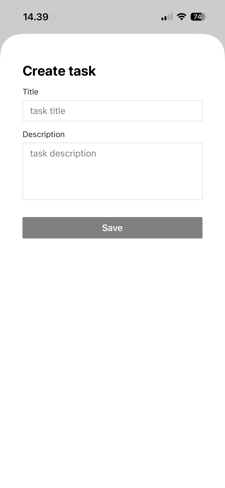
  <figcaption>Create task modal</figcaption>
</figure>
<figure>
  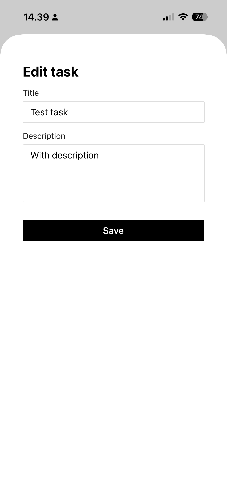
  <figcaption>Edit task modal</figcaption>
</figure>
<figure>
  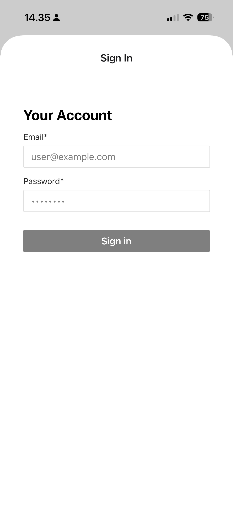
  <figcaption>Sign in modal</figcaption>
</figure>
<figure>
  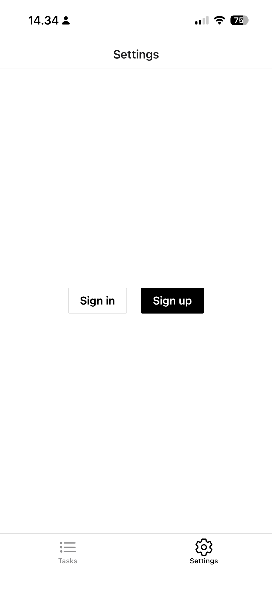
  <figcaption>Sign in and sign up screen</figcaption>
</figure>
<figure>
  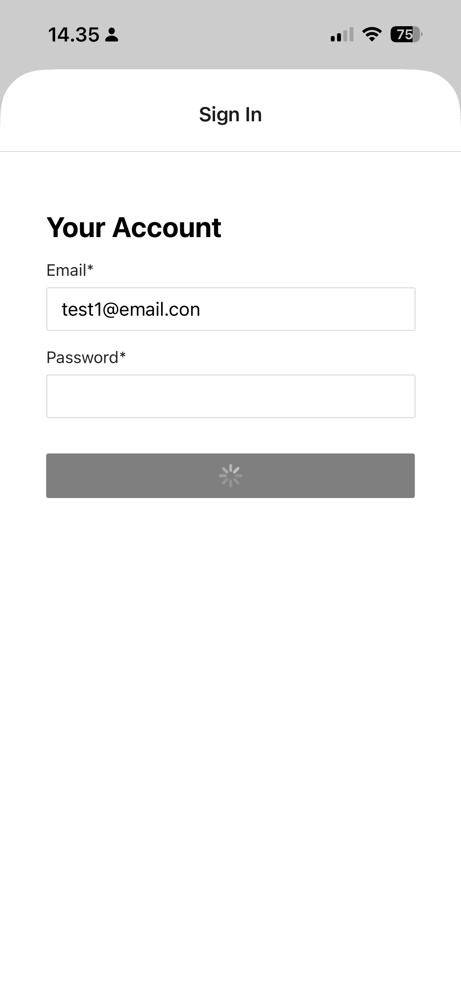
  <figcaption>Sign in with loading icon</figcaption>
</figure>
<figure>
  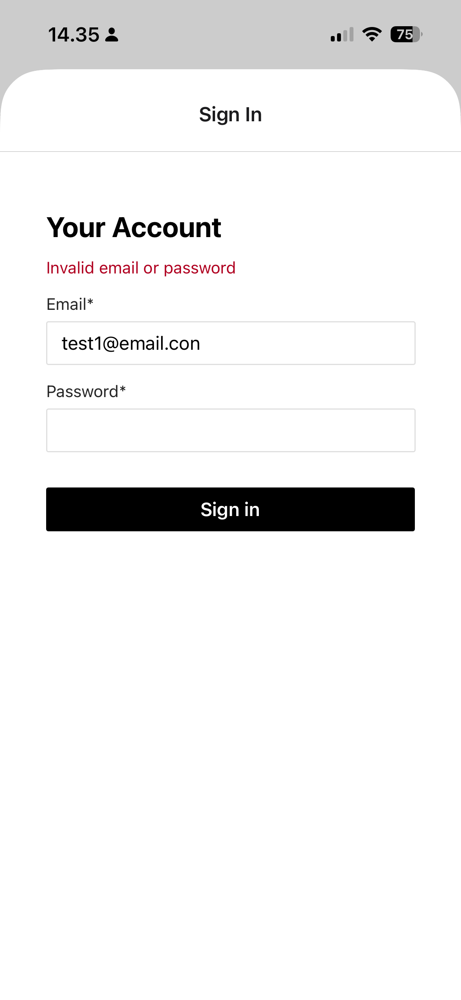
  <figcaption>Sign in with validation error</figcaption>
</figure>
<figure>
  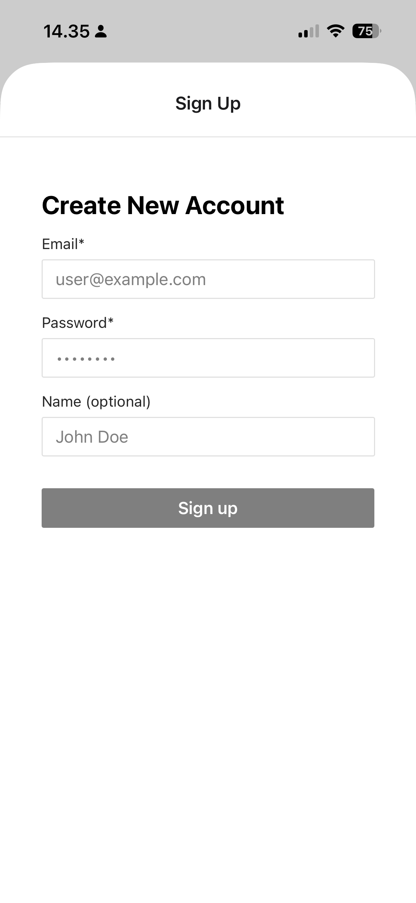
  <figcaption>Sign up modal</figcaption>
</figure>
<figure>
  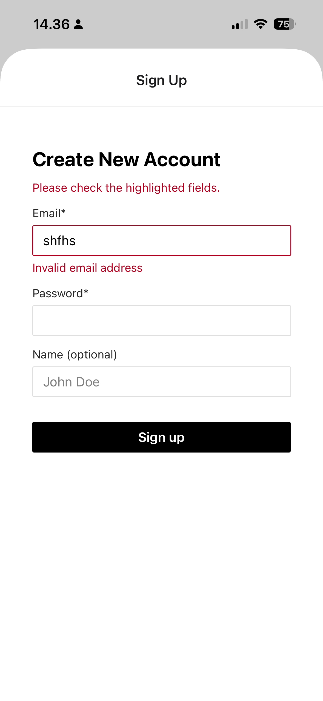
  <figcaption>Sign up with validation error</figcaption>
</figure>
<figure>
  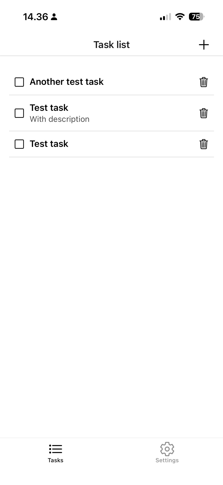
  <figcaption>Task list screen</figcaption>
</figure>
<figure>
  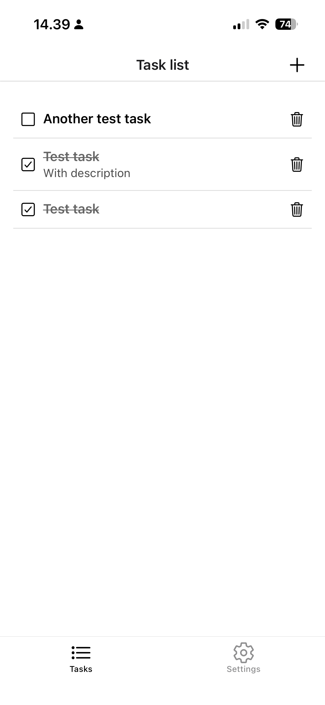
  <figcaption>Task list with completed update</figcaption>
</figure>
<figure>
  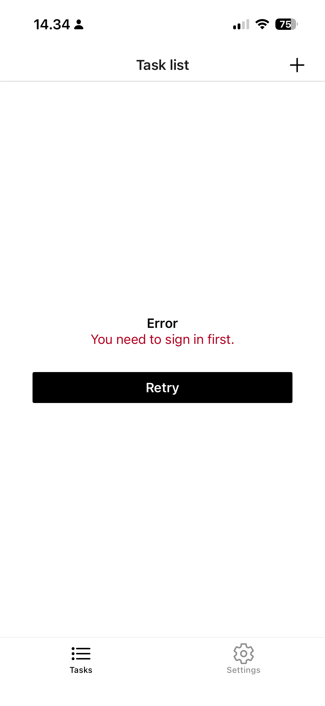
  <figcaption>Unified error screen</figcaption>
</figure>
<figure>
  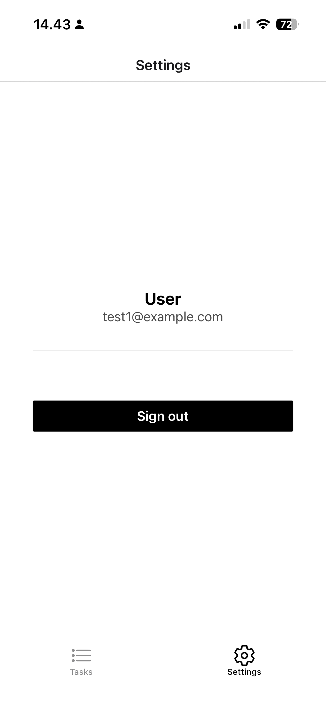
  <figcaption>User profile screen with sign out</figcaption>
</figure>
